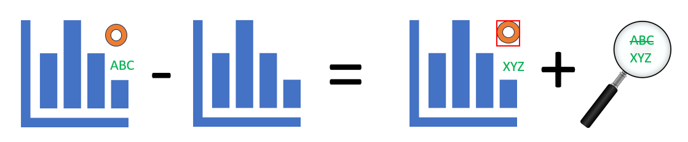
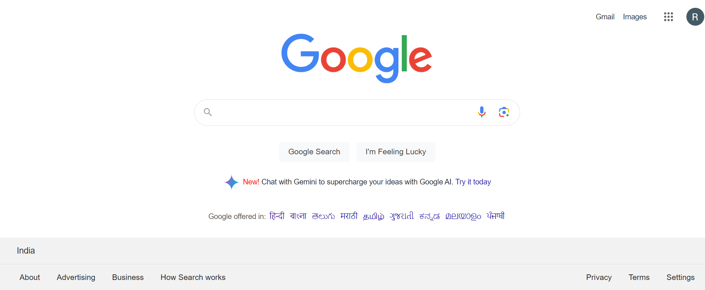
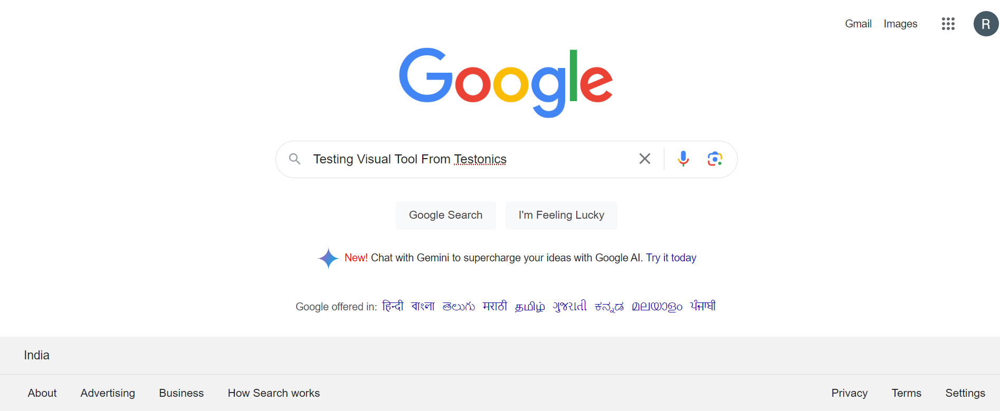
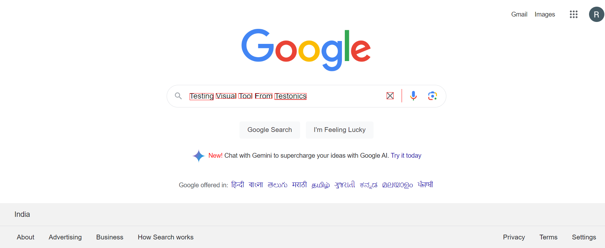

## About
Published on Maven Central that compares 2 images with the same sizes and shows the differences visually by drawing rectangles. Some parts of the image can be excluded from the comparison. Can be used for automation qa tests.

*   Pixels (with the same coordinates in two images) can be visually similar, but have different values of RGB. 2 pixels are considered to be "different" if they differ more than `pixelToleranceLevel`(this configuration described below) from each other.

*   The output of the comparison is a copy of `actual` images. The differences are outlined with red rectangles as shown below.

*   A list of all the mismatches is also returned as output to be asserted as validation

*   Some parts of the image can be excluded from the comparison and drawn in the result image.

## Configuration
All these configurations can be updated based on your needs.

| *Property* | *Description*                                                                                                                                                                      |
| --- |------------------------------------------------------------------------------------------------------------------------------------------------------------------------------------|
| `threshold` | The threshold which means the max distance between non-equal pixels. Could be changed according size and requirements to the image.                                                |
| `rectangleLineWidth` | Width of the line that is drawn the rectangle.                                                                                                                                     |
| `destination` | File of the result destination.                                                                                                                                                    |
| `minimalRectangleSize` | The number of the minimal rectangle size. Count as (width x height). By default it's 1.                                                                                            |
| `maximalRectangleCount` | Maximal count of the Rectangles, which would be drawn. It means that would get first x biggest rectangles. Default value is -1, that means that all the rectangles would be drawn. |
| `pixelToleranceLevel` | Level of the pixel tolerance. By default it's 0.1 -> 10% difference. The value can be set from 0.0 to 0.99.                                                                        |
| `excludedAreas` | ExcludedAreas contains a List of Rectangles to be ignored when comparing images.                                                                                                   |
| `drawExcludedRectangles` | Flag which says draw excluded rectangles or not.                                                                                                                                   |
| `fillExcludedRectangles` | Flag which says fill excluded rectangles or not.                                                                                                                                   |
| `percentOpacityExcludedRectangles` | The desired opacity of the excluded rectangle fill.                                                                                                                                |
| `fillDifferenceRectangles` | Flag which says fill difference rectangles or not.                                                                                                                                 |
| `percentOpacityDifferenceRectangles` | The desired opacity of the difference rectangle fill.                                                                                                                              |
| `allowingPercentOfDifferentPixels` | The percent of the allowing pixels to be different to stay MATCH for comparison. E.g. percent of the pixels, which would ignore in comparison. Value can be from 0.0 to 100.00     |
| `differenceRectangleColor` | Rectangle color of image difference. By default, it's red.                                                                                                                         |
| `excludedRectangleColor` | Rectangle color of excluded part. By default, it's green.                                                                                                                          |
| `imageResizeFlag` | Resize the image equal to expected image before comparison . Default to False                                                                                                      |
| `imageResolution` | Sets the image resolution. Default to 70                                                                                                                                           |
| `extractText` | Sets the flag to do textucal validation. Default to false                                                                                                                          |
| `language` | Required if extractText flag is True, download the file for the language and sets the path                                                                                         |

## Usage

#### Maven
```xml
<dependency>
    <groupId>in.testonics.omni</groupId>
    <artifactId>visual</artifactId>
    <version>1.0.0</version>
</dependency>
```
#### Gradle
```groovy
compile 'in.testonics.omni:visual:1.0.0'
```

#### To compare two images programmatically
##### Default way to compare two images looks like:
```java
        //Sets the object of Visual Comparison
        VisualComparison visualComparison = new VisualComparison();

        //By default, result file will be saved at root location of the project
        File file1 = new File(".\\ImageExpected.png");
        File file2 = new File(".\\ImageActual.png");
        VisualComparisonResult visualComparisonResult = visualComparison.compareImages(file1, file2);
```

##### Save result image at custom location
Use the setDestination method of VisualComparison
```java
        //Sets the object of Visual Comparison
        VisualComparison visualComparison = new VisualComparison();

        //Optional : If not set, result file will be saved at root location with the name "results.png"
        visualComparison.setDestination(new File(".\\target\\results.png"));
        
        File file1 = new File(".\\ImageExpected.png");
        File file2 = new File(".\\ImageActual.png");
        VisualComparisonResult visualComparisonResult = visualComparison.compareImages(file1, file2);
```

##### Enable Textual Comparison
2. Set the extractImage flag as True and Set the path of the language file
```java
        //Sets the object of Visual Comparison
        VisualComparison visualComparison = new VisualComparison();

        //Optional : If not set, result file will be saved at root location with the name "results.png"
        visualComparison.setDestination(new File(".\\target\\results.png"));
        visualComparison.setResizeImage(true);

        //Set below parameters if textual comparison is required
        visualComparison.setExtractImageFlag(true);
        //Download the language file from the link and set the folder path
        visualComparison.setLanguagePath(".\\language");

        File file1 = new File(".\\ImageExpected.png");
        File file2 = new File(".\\ImageActual.png");
        VisualComparisonResult visualComparisonResult = visualComparison.compareImages(file1, file2);

        //Print the results as needed
        System.out.println("Percentile Mismatch : " + visualComparisonResult.getDifferencePercent());
        System.out.println("Textual Mismatch : " + visualComparisonResult.getMismatch()); 
```

## Demo
Demo shows how `Visual` works.
 
Expected Image


Actual Image


Result


Print the Failures To Assert
```java
        //Image Percentile & Text Mismatch can be printed using VisualComparisonResult.
        System.out.println("Percentile Mismatch : " + visualComparisonResult.getDifferencePercent());
        System.out.println("Textual Mismatch : " + visualComparisonResult.getMismatch()); 
```

Retrieves the text from an Image
```java
        //Image Percentile & Text Mismatch can be printed using VisualComparisonResult.
        System.out.println(Image.getImageText("Image.png")); 
```

## License
This project is Apache License 2.0 - see the [LICENSE](LICENSE) file for details

## Release Notes

Can be found in [RELEASE_NOTES](RELEASE_NOTES.md).

## Code of Conduct
Please, follow [Code of Conduct](CODE_OF_CONDUCT.md) page.

#### Also if you're interesting - see my other repositories
*   [Keep Alive](https://github.com/testoncis/keep-alive) - Keeps the computer awake
